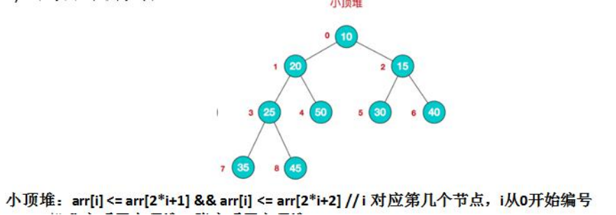
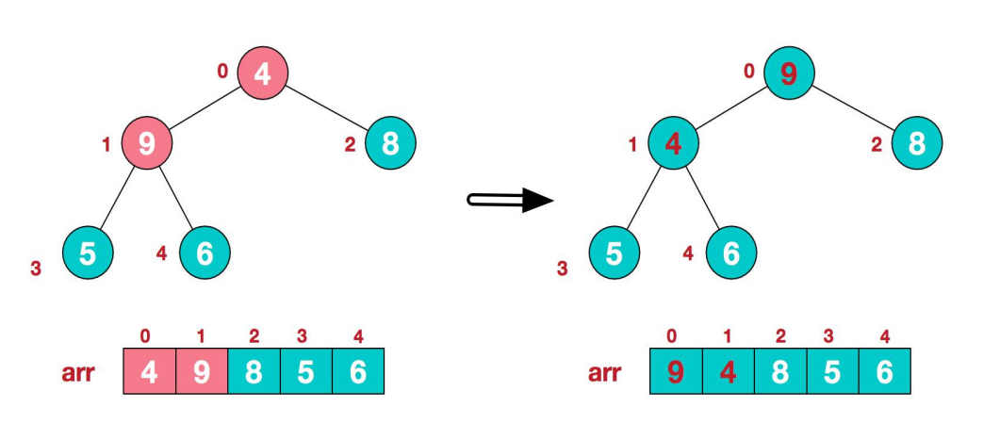
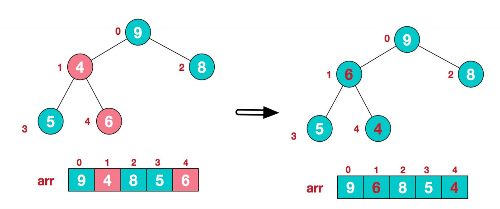
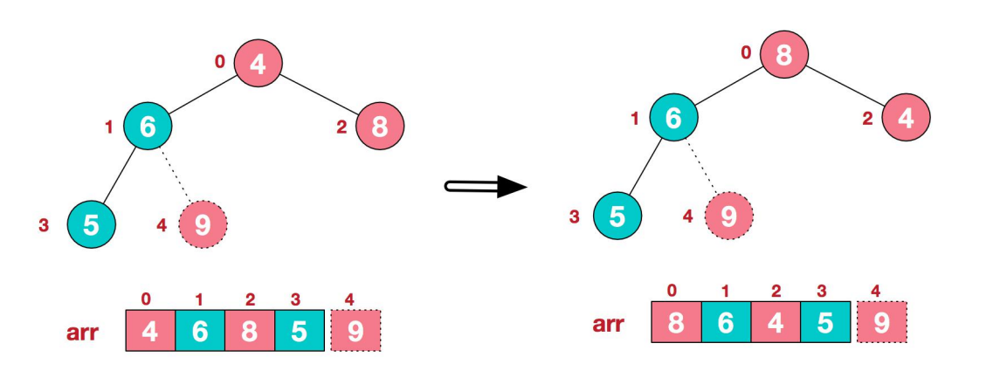
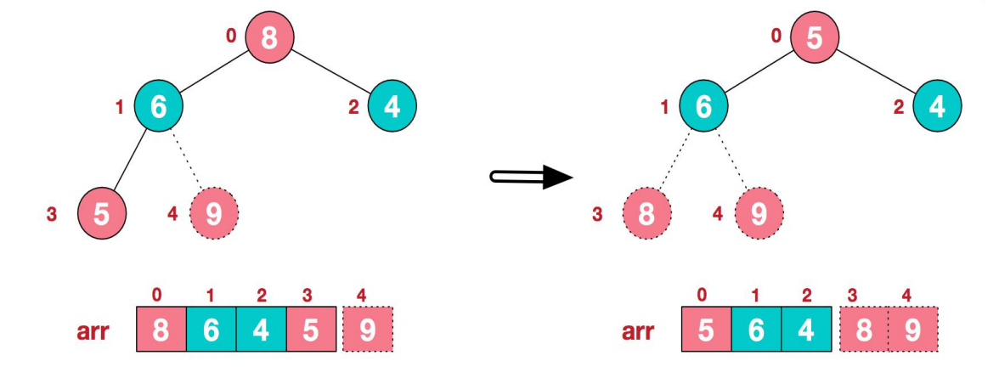

### 堆排序

####  堆排序基本介绍 

1) 堆排序是利用堆这种数据结构而设计的一种排序算法，堆排序是一种选择排序，它的最坏，最好，平均时间复杂度均为 **O(nlogn)**，它也是不稳定排序。 

2) 堆是具有以下性质的完全二叉树：每个结点的值都大于或等于其左右孩子结点的值，称为大顶堆, **注意 : 没有要求结点的左孩子的值和右孩子的值的大小关系。** 

3) 每个结点的值都小于或等于其左右孩子结点的值，称为小顶堆 

4) 大顶堆举例说明 

5)小堆顶举例说明

6) 一般升序采用大顶堆，降序采用小顶堆

#### 堆排序基本思想

堆排序的基本思想是： 

1) 将待排序序列构造成一个大顶堆 

2) 此时，整个序列的最大值就是堆顶的根节点。 

3) 将其与末尾元素进行交换，此时末尾就为最大值。 

4) 然后将剩余 n-1 个元素重新构造成一个堆，这样会得到 n 个元素的次小值。如此反复执行，便能得到一个有序序列了。可以看到在构建大顶堆的过程中，元素的个数逐渐减少，最后就得到一个有序序列了. 

#### 堆排序步骤图解说明 

要求：给你一个数组 {4,6,8,5,9} , 要求使用堆排序法，将数组升序排序。

**步骤一 构造初始堆。将给定无序序列构造成一个大顶堆（一般升序采用大顶堆，降序采用小顶堆)。**

**原始的数组 [4, 6, 8, 5, 9]**

1) .假设给定无序序列结构如下

2) .此时我们从最后一个非叶子结点开始（叶结点自然不用调整，第一个非叶子结点arr.length/2-1=5/2-1=1，也就是下面的 6 结点），从左至右，从下至上进行调整。

3) .找到第二个非叶节点 4，由于[4,9,8]中 9 元素最大，4 和 9 交换。

4) 这时，交换导致了子根[4,5,6]结构混乱，继续调整，[4,5,6]中 6 最大，交换 4 和 6。

此时，我们就将一个无序序列构造成了一个大顶堆。

**步骤二 将堆顶元素与末尾元素进行交换，使末尾元素最大。然后继续调整堆，再将堆顶元素与末尾元素交换，得到第二大元素。如此反复进行交换、重建、交换。** 

1) .将堆顶元素 9 和末尾元素 4 进行交换

2) .重新调整结构，使其继续满足堆定义

3) .再将堆顶元素 8 与末尾元素 5 进行交换，得到第二大元素 8

4) 后续过程，继续进行调整，交换，如此反复进行，最终使得整个序列有序

