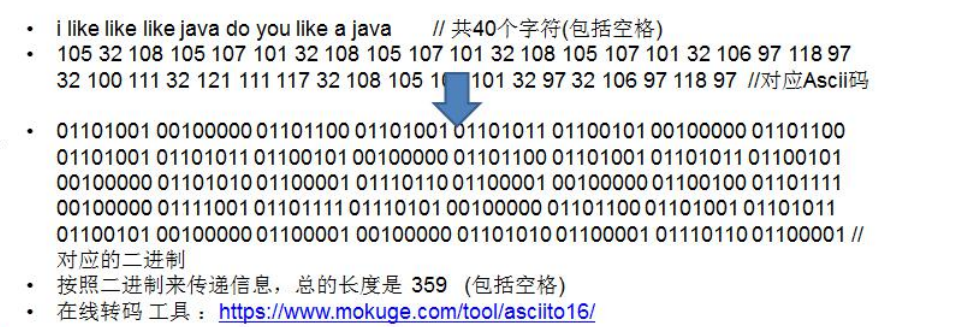

### 赫夫曼编码

#### 基本介绍

1) 赫夫曼编码也翻译为 哈夫曼编码(Huffman Coding)，又称霍夫曼编码，是一种编码方式, 属于一种程序算法 

2) 赫夫曼编码是赫哈夫曼树在电讯通信中的经典的应用之一。 

3) 赫夫曼编码广泛地用于数据文件压缩。其压缩率通常在 20%～90%之间 

4) 赫夫曼码是可变字长编码(VLC)的一种。Huffman 于 1952 年提出一种编码方法，称之为最佳编码

#### 原理剖析

通信领域中信息的处理方式 1-定长编码

通信领域中信息的处理方式 2-变长编码

