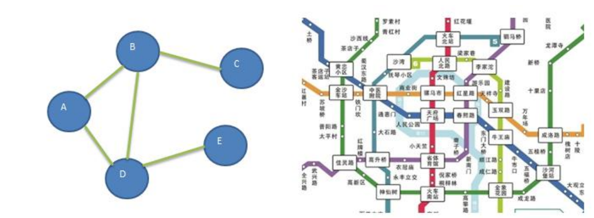
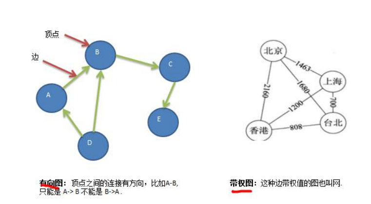

### 图基本介绍

#### 为什么要有图

1) 前面我们学了线性表和树 

2) 线性表局限于一个直接前驱和一个直接后继的关系 

3) 树也只能有一个直接前驱也就是父节点 

4) 当我们需要**表示多对多**的关系时， 这里我们就用到了**图**。

#### 图的举例说明

图是一种**数据结构**，其中结点可以具有零个或多个相邻元素。两个结点之间的连接称为边。结点也可以称为顶点。如图： 

#### 图的常用概念

1) 顶点(vertex) 

2) 边(edge) 

3) 路径 

4) 无向图

5) 有向图 

6) 带权图

