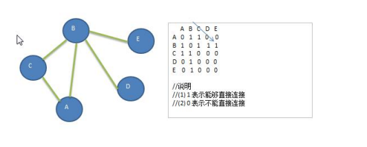

### 图的广度优先遍历

#### 广度优先遍历基本思想

1) 图的广度优先搜索(Broad First Search) 。 

2) 类似于一个**分层搜索**的过程，广度优先遍历需要使用一个队列以保持访问过的结点的顺序，以便按这个顺序来访问这些结点的邻接结点 

##### 广度优先遍历算法步骤 

1) 访问初始结点 v 并标记结点 v 为已访问。 

2) 结点 v 入队列。

3) 当队列非空时，继续执行，否则算法结束。 

4) 出队列，取得队头结点 u。 

5) 查找结点 u 的第一个邻接结点 w。 

6) 若结点 u 的邻接结点 w 不存在，则转到步骤 3；否则循环执行以下三个步骤： 
   6.1 若结点 w 尚未被访问，则访问结点 w 并标记为已访问。 

   6.2 结点 w 入队列 

   6.3 查找结点 u 的继 w 邻接结点后的下一个邻接结点 w，转到步骤 6。

#### 广度优先算法的图示

代码实现

