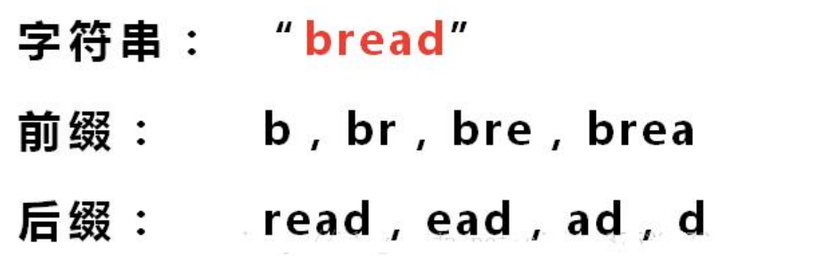

### KMP 算法

#### 应用场景-字符串匹配问题 

字符串匹配问题：： 

1) 有一个字符串 str1= "阿里巴巴 阿里巴巴你阿里巴巴阿里你阿里巴巴你阿里你好"，和一个子串 str2="阿里巴巴你阿里你" 

2) 现在要判断 str1 是否含有 str2, 如果存在，就返回第一次出现的位置, 如果没有，则返回-1 

#### 暴力匹配算法

如果用暴力匹配的思路，并假设现在 str1 匹配到 i 位置，子串 str2 匹配到 j 位置，则有: 

1) 如果当前字符匹配成功（即 str1[i] == str2[j]），则 i++，j++，继续匹配下一个字符 

2) 如果失配（即 str1[i]! = str2[j]），令 i = i - (j - 1)，j = 0。相当于每次匹配失败时，i 回溯，j 被置为 0。 

3) 用暴力方法解决的话就会有大量的回溯，每次只移动一位，若是不匹配，移动到下一位接着判断，浪费了大量的时间。(不可行!) 

4) 暴力匹配算法实现. 

5) 代码

```java
package com.romanticlei.kmp;

public class ViolenceMatch {

    public static void main(String[] args) {
        String str1 = "阿里巴巴 阿里巴巴你阿里巴巴阿里你阿里巴巴你阿里你好";
        String str2 = "阿里巴巴你阿里你";
        int index = violenceMatch(str1, str2);
        System.out.println("idnex = " + index);
    }

    // 暴力破解算法实现
    public static int violenceMatch(String str1, String str2){
        char[] s1 = str1.toCharArray();
        char[] s2 = str2.toCharArray();

        int s1Len = s1.length;
        int s2Len = s2.length;
        int i = 0; // i索引指向s1
        int j = 0; // j索引指向s2

        while (i < s1Len && j < s2Len) {
            if (s1[i] == s2[j]) {
                i++;
                j++;
            } else {
                // 如果没有匹配成功，（即s1[i] ！= s2[j]，令i = i - (j - 1)）
                // 让 i 后移一位，重新开始匹配
                i = i - (j - 1);
                j = 0;
            }
        }

        // 判断匹配成功
        if (j == s2Len) {
            return i - j;
        } else {
            return -1;
        }
    }
}
```


#### KMP 算法介绍

1) KMP 是一个解决模式串在文本串是否出现过，如果出现过，最早出现的位置的经典算法 

2) Knuth-Morris-Pratt 字符串查找算法，简称为 “KMP 算法”，常用于在一个文本串 S 内查找一个模式串 P 的出现位置，这个算法由 Donald Knuth、Vaughan Pratt、James H. Morris 三人于 1977 年联合发表，故取这 3 人的姓氏命名此算法. 

3) KMP 方法算法就利用之前判断过信息，通过一个 next 数组，保存模式串中前后最长公共子序列的长度，每次回溯时，通过 next 数组找到，前面匹配过的位置，省去了大量的计算时间 

4) 参考资料：https://www.cnblogs.com/ZuoAndFutureGirl/p/9028287.html

#### KMP 算法最佳应用-字符串匹配问题

字符串匹配问题：： 

1) 有一个字符串 str1= "BBC ABCDAB ABCDABCDABDE"，和一个子串 str2="ABCDABD" 

2) 现在要判断 str1 是否含有 str2, 如果存在，就返回第一次出现的位置, 如果没有，则返回-1 

3) 要求：使用 **KMP** **算法完成**判断，不能使用简单的暴力匹配算法. 

思路分析图解

举例来说，有一个字符串 Str1 = “BBC ABCDAB ABCDABCDABDE”，判断，里面是否包含另一个字符串 Str2 = “ABCDABD”？ 

1.首先，用 Str1 的第一个字符和 Str2 的第一个字符去比较，不符合，关键词向后移动一位 


2.重复第一步，还是不符合，再后移 


3.一直重复，直到 Str1 有一个字符与 Str2 的第一个字符符合为止


4.接着比较字符串和搜索词的下一个字符，还是符合。


5.遇到 Str1 有一个字符与 Str2 对应的字符不符合。


6.这时候，想到的是继续遍历 Str1 的下一个字符，重复第 1 步。(其实是很不明智的，因为此时 BCD 已经比较过了，没有必要再做重复的工作，一个基本事实是，当空格与 D 不匹配时，你其实知道前面六个字符是”ABCDAB”。KMP 算法的想法是，设法利用这个已知信息，不要把”搜索位置”移回已经比较过的位置，继续把它向后移，这样就提高了效率。)


7.怎么做到把刚刚重复的步骤省略掉？可以对 Str2 计算出一张《部分匹配表》，这张表的产生在后面介绍


8.已知空格与 D 不匹配时，前面六个字符”ABCDAB”是匹配的。查表可知，最后一个匹配字符 B 对应的”部分 匹配值”为 2，因此按照下面的公式算出向后移动的位数： 

**移动位数 = 已匹配的字符数 - 对应的部分匹配值** 

因为 6 - 2 等于 4，所以将搜索词向后移动 4 位。

9.因为空格与Ｃ不匹配，搜索词还要继续往后移。这时，已匹配的字符数为 2（”AB”），对应的”部分匹配值”为 0。所以，移动位数 = 2 - 0，结果为 2，于是将搜索词向后移 2 位。


10.因为空格与 A 不匹配，继续后移一位。


11.逐位比较，直到发现 C 与 D 不匹配。于是，移动位数 = 6 - 2，继续将搜索词向后移动4 位。


12.逐位比较，直到搜索词的最后一位，发现完全匹配，于是搜索完成。如果还要继续搜索（即找出全部匹配），移动位数 = 7 - 0，再将搜索词向后移动 7 位，这里就不再重复了。


13.介绍《部分匹配表》怎么产生的 

先介绍前缀，后缀是什么



“部分匹配值”就是”前缀”和”后缀”的最长的共有元素的长度。以”ABCDABD”为例， 

－”A”的前缀和后缀都为空集，共有元素的长度为 0； 

－”AB”的前缀为[A]，后缀为[B]，共有元素的长度为 0； 

－”ABC”的前缀为[A, AB]，后缀为[BC, C]，共有元素的长度 0； 

－”ABCD”的前缀为[A, AB, ABC]，后缀为[BCD, CD, D]，共有元素的长度为 0； 

－”ABCDA”的前缀为[A, AB, ABC, ABCD]，后缀为[BCDA, CDA, DA, A]，共有元素为”A”，长度为 1； 

－”ABCDAB”的前缀为[A, AB, ABC, ABCD, ABCDA]，后缀为[BCDAB, CDAB, DAB, AB, B]，共有元素为”AB”，长度为 2； 

－”ABCDABD”的前缀为[A, AB, ABC, ABCD, ABCDA, ABCDAB]，后缀为[BCDABD, CDABD, DABD, ABD, BD, D]，共有元素的长度为 0。

14.”部分匹配”的实质是，有时候，字符串头部和尾部会有重复。比如，”ABCDAB”之中有两个”AB”，那么 

它的”部分匹配值”就是 2（”AB”的长度）。搜索词移动的时候，第一个”AB”向后移动4 位（字符串长度-部分匹配值），就可以来到第二个”AB”的位置。


代码实现

```java
package com.romanticlei.kmp;

import java.util.Arrays;

public class KMPAlgorithm {

    public static void main(String[] args) {
        String str1 = "BBC ABCDAB ABCDABCDABDE";
        String dest = "ABCDABD";

        int[] next = kmpNext("ABCDABD");
        System.out.println("next = " + Arrays.toString(next));

        int index = kmpSearch(str1, dest, next);
        System.out.println("index = " + index);
    }

    /**
     * KMP 搜索算法
     * @param str1 源字符串
     * @param desc 目标字符串
     * @param next 部分匹配表，是子串的部分匹配表
     * @return 返回-1是没有匹配到，否则返回匹配到的位置
     */
    public static int kmpSearch(String str1, String desc, int[] next){
        
        // 遍历
        for (int i = 0, j = 0; i < str1.length(); i++) {

            while (j > 0 && str1.charAt(i) != desc.charAt(j)){
                j = next[j - 1];
            }

            if (str1.charAt(i) == desc.charAt(j)){
                j++;
            }

            if (j == desc.length()) {
                return i - j + 1;
            }
        }

        return -1;
    }

    // 获取到一个字符串（子串）的部分匹配
    public static int[] kmpNext(String dest) {
        // 创建一个next 数组，保存部分匹配的值
        int[] next = new int[dest.length()];
        // 如果字符串长度时1, 部分匹配值就是0
        next[0] = 0;
        for (int i = 1, j = 0; i < dest.length(); i++) {
            while (j > 0 && dest.charAt(i) != dest.charAt(j)) {
                j = next[j - 1];
            }

            if (dest.charAt(i) == dest.charAt(j)) {
                j++;
            }
            next[i] = j;
        }

        return next;
    }
}
```


