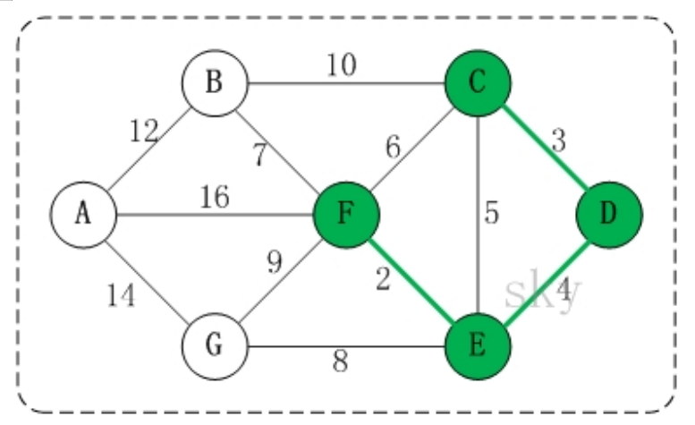

### 克鲁斯卡尔算法

#### 应用场景-公交站问题 

看一个应用场景和问题：

1) 某城市新增 7 个站点(A, B, C, D, E, F, G)，现在需要修路把 7 个站点连通 

2) 各个站点的距离用边线表示(权) ，比如A – B 距离 12 公里 

3) 问：如何修路保证各个站点都能连通，并且总的修建公路总里程最短?

#### 克鲁斯卡尔算法介绍

1)克鲁斯卡尔(Kruskal)算法，是用来求加权连通图的最小生成树的算法。 

2)基本思想：按照权值从小到大的顺序选择 n-1 条边，并保证这 n-1 条边不构成回路 

3)具体做法：首先构造一个只含 n 个顶点的森林，然后依权值从小到大从连通网中选择边加入到森林中，并使森林中不产生回路，直至森林变成一棵树为止

#### 克鲁斯卡尔算法图解说明

以城市公交站问题来图解说明 克鲁斯卡尔算法的原理和步骤：

在含有 n 个顶点的连通图中选择 n-1 条边，构成一棵极小连通子图，并使该连通子图中 n-1 条边上权值之和达到最小，则称其为连通网的最小生成树。

例如，对于如上图 G4 所示的连通网可以有多棵权值总和不相同的生成树。

---

#### 克 鲁 斯 卡 尔 算 法 图 解

以上图 G4 为例，来对克鲁斯卡尔进行演示(假设，用数组 R 保存最小生成树结果)。

**第1步**：将边<E,F>加入R中。 
  边<E,F>的权值最小，因此将它加入到最小生成树结果R中。 
**第2步**：将边<C,D>加入R中。 
  上一步操作之后，边<C,D>的权值最小，因此将它加入到最小生成树结果R中。 
**第3步**：将边<D,E>加入R中。 
  上一步操作之后，边<D,E>的权值最小，因此将它加入到最小生成树结果R中。 
**第4步**：将边<B,F>加入R中。 
  上一步操作之后，边<C,E>的权值最小，但<C,E>会和已有的边构成回路；因此，跳过边<C,E>。同理，跳过边<C,F>。将边<B,F>加入到最小生成树结果R中。 
**第5步**：将边<E,G>加入R中。 
  上一步操作之后，边<E,G>的权值最小，因此将它加入到最小生成树结果R中。 
**第6步**：将边<A,B>加入R中。 
  上一步操作之后，边<F,G>的权值最小，但<F,G>会和已有的边构成回路；因此，跳过边<F,G>。同理，跳过边<B,C>。将边<A,B>加入到最小生成树结果R中。

此时，最小生成树构造完成！它包括的边依次是：**<E,F> <C,D> <D,E> <B,F> <E,G> <A,B>**。

---

#### 克 鲁 斯 卡 尔 算 法 分 析

根据前面介绍的克鲁斯卡尔算法的基本思想和做法，我们能够了解到，克鲁斯卡尔算法重点需要解决的以下两个问题： 
**问题一** 对图的所有边按照权值大小进行排序。 
**问题二** 将边添加到最小生成树中时，怎么样判断是否形成了回路。

问题一很好解决，采用排序算法进行排序即可。

问题二，处理方式是：记录顶点在"最小生成树"中的终点，顶点的终点是"在最小生成树中与它连通的最大顶点"。然后每次需要将一条边添加到最小生存树时，判断该边的两个顶点的终点是否重合，重合的话则会构成回路。

---

#### 如何判断是否构成回路-举例说明(如图)

在将<E,F> <C,D> <D,E>加入到最小生成树R中之后，这几条边的顶点就都有了终点：

**(01)** C的终点是F。 
**(02)** D的终点是F。 
**(03)** E的终点是F。 
**(04)** F的终点是F。

关于终点的说明：

1) 就是将所有顶点按照从小到大的顺序排列好之后；某个顶点的终点就是"与它连通的最大顶点"。 

2) 因此，接下来，虽然<C,E>是权值最小的边。但是C和E的终点都是F，即它们的终点相同，因此，将<C,E>加入最小生成树的话，会形成回路。这就是判断回路的方式。也就是说，**我们加入的边的两个顶点不能都指向同一个终点，否则将构成回路**。【后面有代码说明】

---

