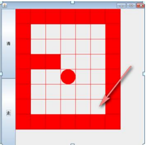

### 递归-迷宫问题

迷宫问题



代码实现

```java
package com.romanticlei.recursion;

import java.util.Arrays;

public class maze {

    public static void main(String[] args) {
        // 声明一个地图
        int[][] map = new int[8][7];
        // 使用 1 表示墙
        for (int i = 0; i < 7; i++) {
            map[i][0] = 1;
            map[i][6] = 1;

            map[0][i] = 1;
            map[7][i] = 1;
        }
        map[7][0] = 1;
        map[7][6] = 1;
        map[3][1] = 1;
        map[3][2] = 1;

        // map[3][3] = 1;
        // map[3][4] = 1;
        //map[3][5] = 1;

        boolean b = setWay(map, 1, 1);
        if (b){
            for (int[] temp: map) {
                for (int value: temp) {
                    System.out.print(value + "\t");
                }
                System.out.println();
            }
        } else {
            System.out.println("没有找到合适的路径");
        }

    }

    /**
     * 使用递归回溯来给小球找路
     * map 表示地图
     * i， j 表示从地图的那个位置开始出发（1,1）
     * 如果小球能到[6][5]位置，表示通路找到
     * 约定：当map[i][j] 为 0 表示改点没有走过，1表示墙，2表示通路可以走，3表示该点已走过，但是不通
     * 在走迷宫时，约定一个探索规则，下->右->上->左，如果该点不通，再回溯
     */
    public static boolean setWay(int[][] map, int i, int j) {
        if (map[6][5] == 2) {
            return true;
        }

        if (map[i][j] == 0) {    // 当前这个点还没有走过
            map[i][j] = 2;      // 假定该点可以走通
            // 向下走
            if (setWay(map, i + 1, j)) {
                return true;
            }
            // 向右走
            if (setWay(map, i, j + 1)) {
                return true;
            }
            // 向上走
            if (setWay(map, i, j - 1)) {
                return true;
            }
            // 向左走
            if (setWay(map, i - 1, j)) {
                return true;
            }

            //四周都走不通，说明该点是死路
            map[i][j] = 3;
            return false;
        } else {
            return false;
        }
    }
}
```

```console
1	1	1	1	1	1	1	
1	2	0	0	0	0	1	
1	2	2	2	0	0	1	
1	1	1	2	0	0	1	
1	0	0	2	0	0	1	
1	0	0	2	0	0	1	
1	0	0	2	2	2	1	
1	1	1	1	1	1	1
```


