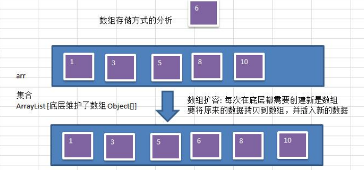
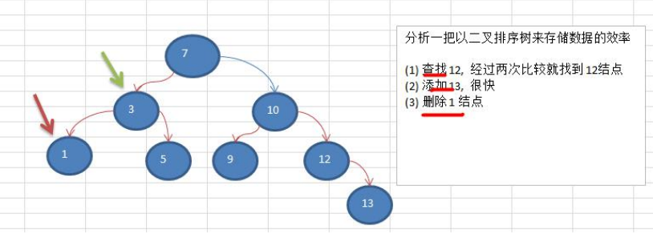
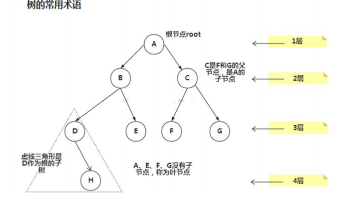

#### 为什么需要树这种数据结构

1) 数组存储方式的分析 

**优点**：通过**下标方式访问元素**，速度快。对于有序数组，还可使用**二分查找**提高检索速度。 

**缺点**：如果要检索具体某个值，或者**插入值(按一定顺序)会整体移动**，效率较低 [示意图] **画出操作示意图**：



2) 链式存储方式的分析 

**优点**：在一定程度上对数组存储方式有优化(比如：**插入**一个数值节点，只需要将插入节点，链接到链表中即可，**删除**效率也很好)。 

**缺点**：在进行**检索时**，效率仍然较低，比如(检索某个值，需要从头节点开始遍历) 

【示意图】 **操作示意图**：


3) **树存储**方式的分析 

能提高数据**存储，读取**的效率, 比如利用 **二叉排序树**(Binary Sort Tree)，既可以保证数据的检索速度，同时也可以保证数据的**插入，删除，修改**的速度。【示意图,后面详讲】 

**案例:** [7, 3, 10, 1, 5, 9, 12]



#### 树示意图



```text
树的常用术语(结合示意图理解): 
1) 节点 
2) 根节点 
3) 父节点 
4) 子节点 
5) 叶子节点 (没有子节点的节点) 
6) 节点的权(节点值) 
7) 路径(从 root 节点找到该节点的路线) 
8) 层 
9) 子树 
10) 树的高度(最大层数) 
11) 森林 :多颗子树构成森林
```

#### 二叉树的概念

1) 树有很多种，每个节点**最多只能有两个子节点**的一种形式称为二叉树。 

2) 二叉树的子节点分为左节点和右节点 

3) 示意图 


