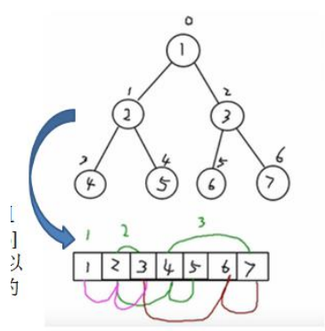

### 顺序存储二叉树

顺序存储二叉树的概念

基本说明 

从数据存储来看，数组存储方式和树的存储方式可以相互转换，即**数组可以转换成树**，**树也可以转换成数组**，看右面的示意图。

要求: 

1) 右图的二叉树的结点，要求以数组的方式来存放 arr : [1, 2, 3, 4, 5, 6, 6] 

2) 要求在遍历数组 arr 时，仍然可以以前序遍历，中序遍历和后序遍历的方式完成结点的遍历 

#### 顺序存储二叉树的特点:

1) 顺序二叉树通常只考虑完全二叉树 

2) 第 n 个元素的左子节点为2 * n + 1 

3) 第 n 个元素的右子节点为2 * n + 2 

4) 第 n 个元素的父节点为 (n-1) / 2 

5) n : 表示二叉树中的第几个元素(按 0 开始编号如图所示)

