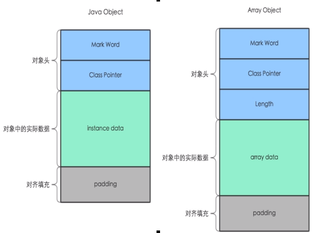
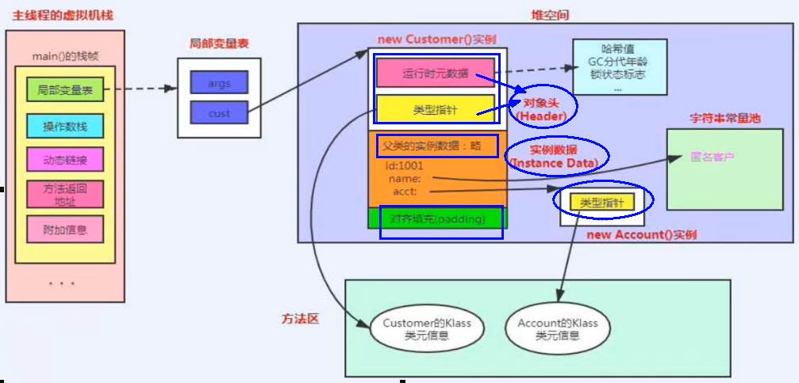

# 权威定义

### 周志明老师JVM第三版

### 对象在堆内存中的存储布局

对象内部结构分为：对象头、实例数据、对齐填充（保证8个字节的倍数）。

对象头分为对象标记（markOop)和类元信息（klassOop)，类元信息存储的是指向该对象类元数据（klass)的首地址。

1. 对象头

   #### 对象标记 Mark Word

   ##### 它保存的是什么：

   

   

   在64位系统中，Mark Word占了8个字节，类型指针占了8个字节，共是16个字节

   

   默认存储对象的HashCode、分代年龄和锁标志位等信息。

   这些信息都是与对象自身定义无关的数据，所以MarkWord被设计成一个非固定的数据结构以便在极小的空间内存存储尽量多的数据。

   它会根据对象的状态复用自己的存储空间，也就是说在运行期间MarkWord里存储的数据会随着锁标志位的变化而变化。

   #### 类元信息(又叫类型指针)

   

   对象指向它的类元数据的指针，虚拟机通过这个指针来确定这个对象是哪个类的实例

   #### 对象头多大

   

2. 实例数据

3. 对其填充

