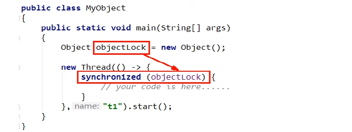

# java5以前，只有Synchronized,这个是操作系统级别的重量级操作

### 重量级锁，假如锁的竞争比较激烈的话，性能下降

### Java5之前，用户态和内核态之间的切换

java的线程是映射到操作系统原生线程之上的，如果要阻塞或唤醒一个线程就需要操作系统介入，需要在户态与核心态之间切换，这种切换会消耗

大量的系统资源，因为用户态与内核态都有各自专用的内存空间，专用的寄存器等，用户态切换至内核态需要传递给许多变量、参数给内核，内核也需要保护好用户态在切换时的一些寄存器值、变量等，以便内核态调用结束后切换回用户态继续工作。

在Java早期版本中，synchronized属于重量级锁，效率低下，因为监视器锁（monitor)是依赖于底层的操作系统的Mutex Lock(系统互斥量）来实现的，挂起线程和恢复线程都需要转入内核态去完成，阻塞或唤醒一个Java线程需要操作系统切换CPU状态来完成，这种状态切换需要耗费处理器时间，如果同步代码块中内容过于简单，这种切换的时间可能比用户代码执行的时间还长”，时间成本相对较高，这也是为什么早期的synchronized效率低的原因。Java 6之后，为了减少获得锁和释放锁所带来的性能消耗，引入了轻量级锁和偏向锁

### markoop.hpp

Monitor可以理解为一种同步工具，也可理解为一种同步机制，常常被描述为一个Java对象。Java对象是天生的Monitor，每一个Java对象都有成为Monitor的潜质，因为在Java的设计中，每一个Java对象自打娘胎里出来就带了一把看不见的锁，它叫做内部锁或者Monitor锁。

Monitor的本质是依赖于底层操作系统的Mutex Lock实现，操作系统实现线程之间的切换需要从用户态到内核态的转换，成本非常高。

