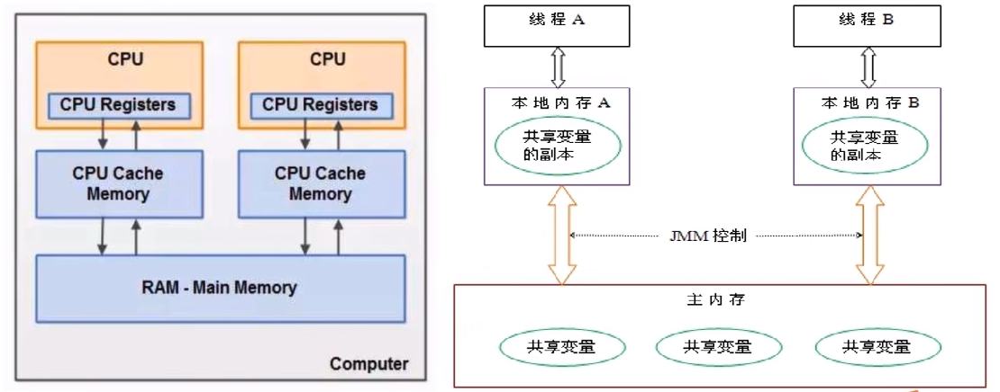

# 可见性

是指当一个线程修改了某一个共享变量的值，其他线程是否能够立即知道该变更，JMM规定了所有的变量都存储在主内存中。

系统主内存共享变量数据修改被写入的时机是不确定的，多线程并发下很可能出现“脏读”，所以每个线程都有自己的工作内存，线程自己的工作内存中保存了该线程使用到的变量的  。线程对变量的所有操作（读取，赋值等）都必需在线程自己的工作内存中进行，而不能够直接读写主内存中的变量。不同线程之间也无法直接访问对方工作内存中的变量，线程间变量值的传递均需要通过主内存来完成

### 线程脏读

- 主内存中有变量x，初始值为0
- 线程A要将x加1，先将x=0拷贝到自己的私有内存中，然后更新x的值
- 线程A将更新后的x值回刷到主内存的时间是不固定的
- 刚好在线程A没有回刷x到主内存时，线程B同样从主内存中读取x，此时为0，和线程A一样的操作，最后期盼的x=2就会变成x=1

# 原子性

指一个操作是不可打断的，即多线程环境下，操作不能被其他线程干扰

# 有序性

### 是什么

对于一个线程的执行代码而言，我们总是习惯性认为代码的执行总是从上到下，有序执行。但为了提升性能，编译器和处理器通常会对指令序列进行重新排序。Java规范规定JVM线程内部维持顺序化语义，即只要程序的最终结果与它顺序化执行的结果相等，那么指令的执行顺序可以与代码顺序不一致，此过程叫指令的重排序。

### 优缺点

JVM能根据处理器特性(CPU多级缓存系统、多核处理器等）适当的对机器指令进行重排序，使机器指令能更符合CPU的执行特性，最大限度的发挥机器性能。但是，指令重排可以保证串行语义一致，但没有义务保证多线程间的语义也一致（即可能产生“脏读”），简单说，两行以上不相干的代码在执行的时候有可能先执行的不是第一条，不见得是从上到下顺序执行，执行顺序会被优化。

从源码到最终执行示例图：

单线程环境里面确保程序最终执行结果和代码顺序执行的结果一致。

处理器在进行重排序时必须要考虑指令之间的数据依赖性

多线程环境中线程交替执行，由于编译器优化重排的存在，两个线程中使用的变量能否保证一致性是无法确定的，结果无法预测。

