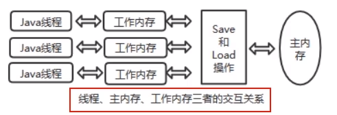

# 可见性

是指当一个线程修改了某一个共享变量的值，其他线程是否能够立即知道该变更，JMM规定了所有的变量都存储在主内存中。

系统主内存共享变量数据修改被写入的时机是不确定的，多线程并发下很可能出现“脏读”，所以每个线程都有自己的工作内存，线程自己的工作内存中保存了该线程使用到的变量的  。线程对变量的所有操作（读取，赋值等）都必需在线程自己的工作内存中进行，而不能够直接读写主内存中的变量。不同线程之间也无法直接访问对方工作内存中的变量，线程间变量值的传递均需要通过主内存来完成

### 线程脏读

- 主内存中有变量x，初始值为0
- 线程A要将x加1，先将x=0拷贝到自己的私有内存中，然后更新x的值
- 线程A将更新后的x值回刷到主内存的时间是不固定的
- 刚好在线程A没有回刷x到主内存时，线程B同样从主内存中读取x，此时为0，和线程A一样的操作，最后期盼的x=2就会变成x=1

# 原子性

# 有序性

