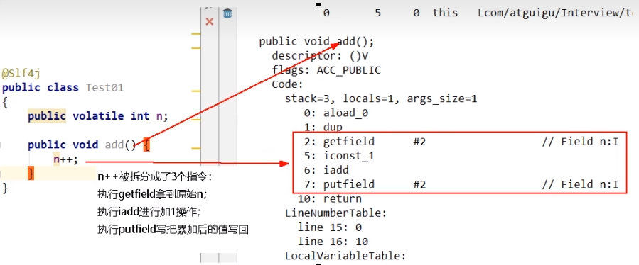

# 保证可见性

保证不同线程对某个变量完成操作后结果及时可见，即该共享变量一旦改变所有线程立即可见

# 没有原子性

volatile变量的复合操作不具有原子性，比如number++

对于volatile变量具备可见性，JVM只是保证从主内存加载到线程工作内存的值是最新的，也仅是数据加载时是最新的。但是多线程环境下，"数据计算"和"数据赋值"操作可能多次出现，若数据在加载之后，若主内存volatile修饰的变量发生修改后，线程工作内存中的操作将会作废去读主内存最新值，操作出现写丢失问题。即各线程私有内存和主内存公共内存中变量不同步，进而导致数据不一致。由此可见volatile解决的是变量读时的可见性问题，但无法保证原子性，对于多线程修改主内存共享变量的场景必须使用加锁同步。

### 字节码角度看i++

