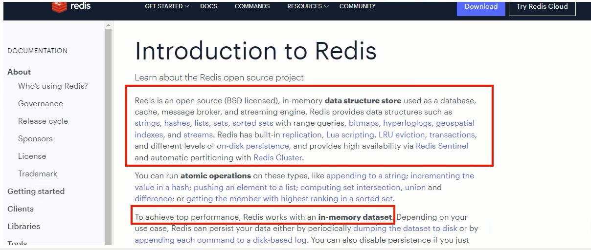
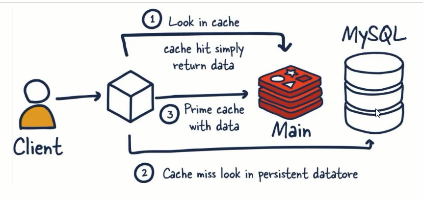

## Redis入门概述

###1.是什么

#####Redis：$\textcolor{red}{RE}$mote $\textcolor{red}{D}$ictionary $\textcolor{red}{S}$erver(远程字典服务器)

#####官网解释：

Remote Dictionary Server$\textcolor{red}{远程字典服务器}$是完全开源的，使用ANSIC语言编写遵守BSD协议，是一个高性能的Key-Value数据库，提供了丰富的数据结构，例如String、Hash、List、Set、SortedSet等等。数据是存在内存中的，同时Redis支持事务、持久化、LUA脚本、发布/订阅、缓存淘汰、流技术等多种功能，提供了主从模式、Redis Sentinel和Redis Cluster集群架构方案

$\textcolor{red}{安特雷兹}$

个人github：github.com/antirez

个人博客：antirez.com/latest/0

###2.能干嘛

##### 主流功能与应用

$\textcolor{red}{1.分布式缓存，挡在MySQL数据库之前的带刀护卫}$

###### 与传统数据库关系(MySQL)

​	·Redis是key-value数据库(NoSQL一种)，MySQL是关系型数据库

​	·Redis数据操作主要在内存，而MySQL主要存储在磁盘

​	·Redis在某一些场景使用中要明显优于MySQL，比如计数器、排行榜等方面

​	·Redis通常用于一些特定场景，需要与MySQL一起配合使用

​	·$\textcolor{red}{两者并不是相互替换和竞争的关系，而是共用和配合使用}$

2.内存存储和持久化（RDB和AOF）

​	Redis支持异步将内存中的数据写到硬盘上，同时不影响继续服务

3.高可用架构搭配

​	单机、主从、哨兵、集群

4.缓存穿透、击穿、雪崩

5.分布式锁

6.队列

​	Redis提供list和Set操作，这使得Redis能作为一个很好的消息队列平台来使用。

​	我们常通过Redis的队列功能做购买限制。比如到了节假日或者推广期间，进行一些活动，对用户购买行为进行限制，限制今天只能购买几次商品或者一段时间内只能购买一次。也比较适合使用。

7.排行榜+点赞

​	在互联网应用中，有各种各样的排行榜，如电商网站的月度销量排行榜、社交APP的礼物排行榜、小程序的投票排行榜等等。Redis提供的zset数据类型能够快速实现这些复杂的排行榜。

​	比如小说网站对小说进行排名，根据排名，将排名靠前的小说推荐给用户。

##### 总体功能概述

##### 优势

​	性能极高-Redis读的速度是110000次/秒，写的速度是81000次/秒

​	Redis数据类型丰富，不仅仅支持简单的Key-Value类型的数据，同时还提供list，set，zset，hash等数据结构的存储

​	Redis支持数据的持久化，可以将内存中的数据保持在磁盘中，重启的时候可以再次加载进行使用

​	Redis支持数据的备份，即master-slave模式的数据备份

##### 小总结

### 2.能干嘛

### 3.去哪下

官网地址: 

英文：https://redis.io/

中文：http://www.redis.cn/	https://www.redis.com.cn/documentation.html

安装包：https://redis.io/download/，选择redis7.0版本即可

Redis源码地址：https://github.com/redis/redis

Redis在线测试地址(不用下载也能玩)：https://try.redis.io/

Redis命令参考：http://doc.redisfans.com/

###4.怎么玩

官网文档；

多种数据类型基本操作和配置；

持久化和复制，RDB/AOF

事务的控制

复制，集群等

