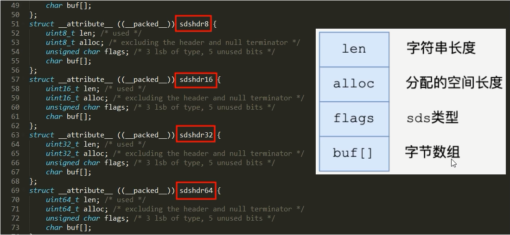
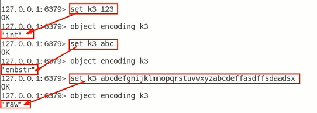
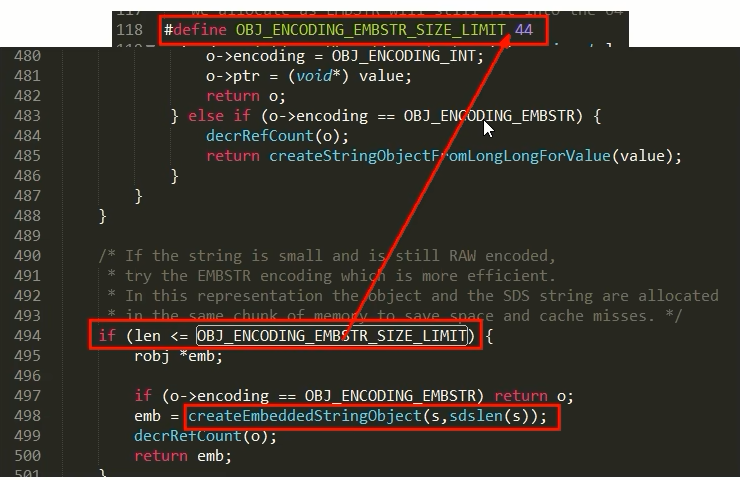
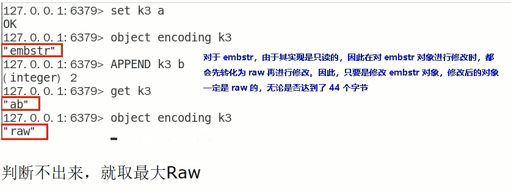
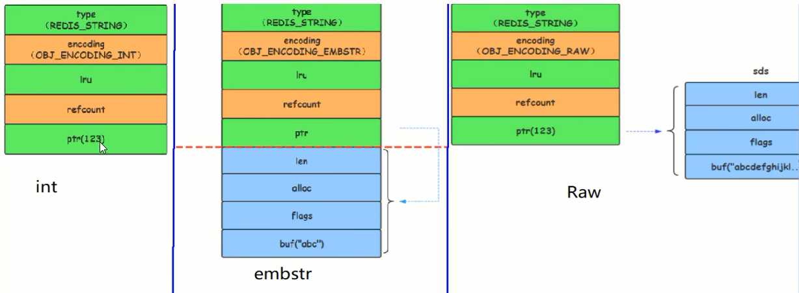

### 3大物理编码格式

**RedisObject内部对应三大物理编码**

1. 整数 int

   - 保存long 型（长整型）的64位（8个字节）有符号整数

     

   - 上面数字最多19位

   - 只有整数才会使用int，如果是浮点数，Redis内部其实先将浮点数转化为字符串值，然后再保存。

2. 嵌入式 embstr

   代表embstr格式的SDS(Simple Dynamic String简单动态字符串)，保存长度小于44字节的字符串

   EMBSTR顾名思义即：embedded string，表示嵌入式的String

3. 未加工数据 raw

   保存长度大于44字节的字符串

### 3大物理编码案例

- 案例演示

  

- C语言中字符串的展现

  

  Redis没有直接复用C语言的字符串，而是新建了属于自己的结构-----SDS
  在Redis数据库里，包含字符串值的键值对都是由SDS实现的(Redis中所有的键都是由字符串对象实现的即底层是由SDS实现，Redis中所有的值对象中包含的字符串对象底层也是由SDS实现)。

  

- SDS简单动态字符串

  - sds.h源码分析

    

  - 说明

    

    Redis中字符串的实现,SDS有多种结构( sds.h) :
    sdshdr5、(2^5=32byte)，但是不会使用，是redis团队内部测试使用
    sdshdr8、(2^8=256byte)
    sdshdr16、(2^16=65536byte=64KB)
    sdshdr32、(2 ^32byte=4GB)
    sdshdr64，2的64次方byte=17179869184G用于存储不同的长度的字符串。

    len表示SDS的长度，使我们在获取字符串长度的时候可以在o(1)情况下拿到，而不是像C那样需要遍历一遍字符串。

    alloc可以用来计算 free就是字符串已经分配的未使用的空间，有了这个值就可以引入预分配空间的算法了，而不用去考虑内存分配的问题。

    buf表示字符串数组，真实存数据的。

  - 官网

- Redis为什么要重新设计一个SDS数据结构？

  

  |                | C语言                                                        | SDS                                                          |
  | -------------- | ------------------------------------------------------------ | ------------------------------------------------------------ |
  | 字符串长度处理 | 需要从头开始遍历,直到遇到'\O'为止，时间复杂度O(N)            | 记录当前字符串的长度，直接读取即可，时间复杂度O(1)           |
  | 内存重新分配   | 分配内存空间超过后，会导致数组下标越级或者内存分配溢出       | 空间预分配 SDS修改后，len长度小于1M，那么将会额外分配与 len相同长度的未使用空间。如果修改后长度大于1M，那么将分配1M的使用空间。 惰性空间释放 有空间分配对应的就有空间释放。SDS缩短时并不会回收多余的内存空间,而是使用free字段将多出来的空间记录下来。如果后续有变更操作，直接使用free中记录的空间，减少了内存的分配。 |
  | 二进制安全     | 二进制数据并不是规则的字符串格式，可能会包含一些特殊的字符，比如 '\0'等。前面提到过，C中字符串遇到'\0'会结束,那'\0'之后的数据就读取不上了 | 根据len长度来判断字符串结束的，二进制安全的问题就解决了      |

- 源码分析

  用户API

  set k1 v1 底层发生了什么？调用关系？

  

  3大物理编码方式

  

  INT编码格式

  命令示例: set k1 123

  当字符串键值的内容可以用一个64位有符号整形来表示时，Redis会将键值转化为long型来进行存储，此时即对应 OB_ENCODING_INT 编码类型。内部的内存结构表示如下:

  

  EMBSTR编码格式

  

  对于长度小于 44的字符串，Redis 对键值采用OBJ_ENCODING_EMBSTR 方式，EMBSTR 顾名思义即: embedded string，表示嵌入式的String。从内存结构上来讲 即字符串 sds结构体与其对应的 redisObject 对象分配在同一块连续的内存空间，字符串sds嵌入在redisObiect对象之中一样。

- RAW编码格式

  当字符串的键值为长度大于44的超长字符串时，Redis 则会将键值的内部编码方式改为OBJ_ENCODING_RAW格式，这与OBJ_ENCODING_EMBSTR编码方式的不同之处在于，此时动态字符sds的内存与其依赖的redisobiect的内存不再连续了

- 明明没有超过阈值，为什么变成raw了

  

### 案例结论

只有整数才会使用int,如果是浮点数, Redis内部其实先将浮点数转化为字符串值,然后再保存

embstr与raw类型底层的数据结构其实都是SDS(简单动态字符串，Redis内部定义sdshdr一种结构)

| int    | Long类型整数时，RedisObiect中的ptr指针直接赋值为整数数据，不再额外的指针再指向整数了，节省了指针的空间开销。 |
| ------ | ------------------------------------------------------------ |
| embstr | 当保存的是字符串数据且字符串小于等于44字节时，emstr类型将会调用内存分配函数，只分配一块连续的内存空间，空间中依次包含 redisObject 与 sdshdr 两个数据结构，让元数据、指针和SDS是一块连续的内存区域，这样就可以避免内存碎片 |
| raw    | 当字符串大于44字节时，SDS的数据量变多变大了，SDS和RedisObject布局分家各自过，会给SDS分配多的空间并用指针指SDS结构，raw 类型将会调用两次内存分配函数，分配两块内存空间，一块用于包含 redisObiect结构，而另一块用于包含sdshdr 结构 |

