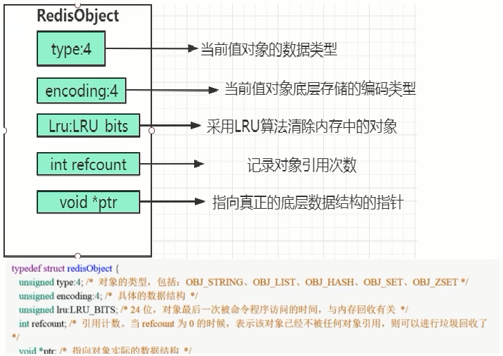

### 3大物理编码格式

**RedisObject内部对应三大物理编码**

1. 整数 int

   - 保存long 型（长整型）的64位（8个字节）有符号整数

     

   - 上面数字最多19位

   - 只有整数才会使用int，如果是浮点数，Redis内部其实先将浮点数转化为字符串值，然后再保存。

2. 嵌入式 embstr

   代表embstr格式的SDS(Simple Dynamic String简单动态字符串)，保存长度小于44字节的字符串

   EMBSTR顾名思义即：embedded string，表示嵌入式的String

3. 未加工数据 raw

   保存长度大于44字节的字符串

### 3大物理编码案例

- 案例演示

  

- C语言中字符串的展现

  

  Redis没有直接复用C语言的字符串，而是新建了属于自己的结构-----SDS
  在Redis数据库里，包含字符串值的键值对都是由SDS实现的(Redis中所有的键都是由字符串对象实现的即底层是由SDS实现，Redis中所有的值对象中包含的字符串对象底层也是由SDS实现)。

  

- SDS简单动态字符串

  - sds.h源码分析

    

  - 说明

    

    Redis中字符串的实现,SDS有多种结构( sds.h) :
    sdshdr5、(2^5=32byte)，但是不会使用，是redis团队内部测试使用
    sdshdr8、(2^8=256byte)
    sdshdr16、(2^16=65536byte=64KB)
    sdshdr32、(2 ^32byte=4GB)
    sdshdr64，2的64次方byte=17179869184G用于存储不同的长度的字符串。

    len表示SDS的长度，使我们在获取字符串长度的时候可以在o(1)情况下拿到，而不是像C那样需要遍历一遍字符串。

    alloc可以用来计算 free就是字符串已经分配的未使用的空间，有了这个值就可以引入预分配空间的算法了，而不用去考虑内存分配的问题。

    buf表示字符串数组，真实存数据的。

  - 官网

- Redis为什么要重新设计一个SDS数据结构？

  

- 

