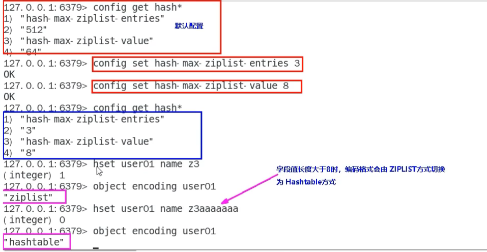

### Hash的两种编码格式

Redis6以前：ziplist、Hashtable

Redis7：listpack、Hashtable

## Redis6

hash-max-ziplist-entries：使用压缩列表保存时哈希集合中的最大元素个数。

hash-max-ziplist-value：使用压缩列表保存时哈希集合中单个元素的最人长度。

Hash类型键的字段个数 小于 hash-max-ziplist-entries 并且每个字段名和字段值的长度 小于 hash-max-ziplist-value 时，Redis才会使用 OBJ_ENCODING_ZIPLIST来存该键，前述条件任意一个不满足则会转换为 OBJ_ENCODING_HT的编码方式

### 结论

1. 哈希对象保存的键值对数量小于 512个；
2. 所有的键值对的健和值的字符串长度都小于等于 64byte (一个英文字母一个字节)时用ziplist，反之用hashtable；
3. ziplist升级到hashtable可以，反过来降级不可以；即一旦从压缩列表转为了哈希表，Hash类型就会一直用哈希表进行保存而不会再转回压缩列表了。在节省内存空间方面哈希表就没有压缩列表高效了。

