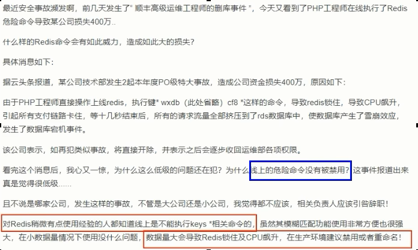

# MoreKey案例

- 大批量往redis里面插入2000W测试数据key

  Linux Bash下面执行，插入100W数据

  ​	生成100W条redis批量设置kv的语句(key=kn,value=vn)写入到/tmp目录下的redisTest.txt文件中

  ```	shell
  	for((i=1;i<=100*10000;i++)); do echo "set ksi v$i" >> /tmp/redisTest.txt ;done;
  ```

  ​	通过redis提供的管道-pipe命令插入100W大批量数据

  ```shell
  	cat /tmp/redisTest.txt | /opt/redis-7.0.0/src/redis-cli -h 127.0.0.1 -p 6379-a 111111 --pipe
  ```

  

- 某快递巨头真实生产案例新闻

  - 新闻

    

  - keys * 试试100W花费多少秒遍历查询

    

    <font color = blue>keys * 这个指令有致命的弊端，在实际环境中最好不要使用</font>

    ```tex
    这个指令没有offset、limit 参数，是要一次性吐出所有满足条件的key，由于redis,是单线程的，其所有操作都是原子的，而keys算法是遍历算法，复杂度是O(n)，如果实例中有千万级以上的 key，这个指令就会导致Redis服务卡顿，所有读写Redis 的其它的指令都会被延后甚至会超时报错，可能会引起缓存雪崩甚至数据库宕机。
    ```

  - <font color = red>生产上限值 keys * /flushdb/flushall等危险命令以防止误删误用</font>

  ​

- 不用keys *避免卡顿，那该用什么

  ​