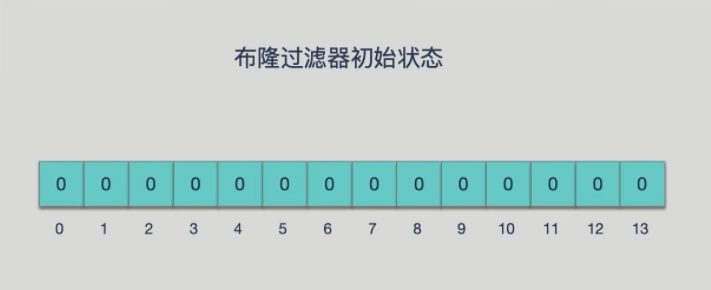
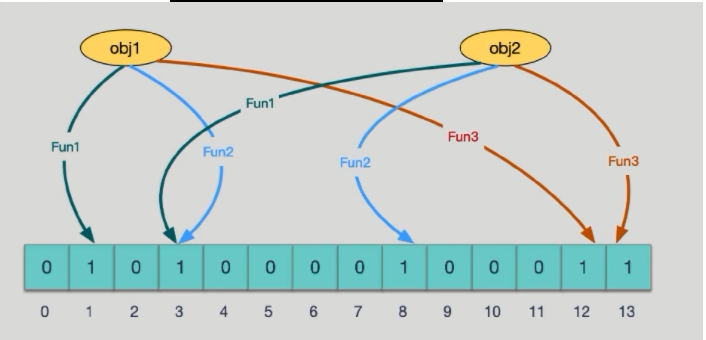

# 布隆过滤器原理

### 布隆过滤器实现原理和数据结构

- 原理

  布隆过滤器(Bloom Filter) 是一种专门用来解决去重问题的高级数据结构。

  实质就是<font color = 'red'>一个大型位数组和几个不同的无偏hash函数</font>(无偏表示分布均匀)。由一个初值都为零的bit数组和多个哈希函数构成，用来快速判断某个数据是否存在。但是跟 HyperLogLog 一样，它也一样有那么一点点不精确，也存在一定的误判概率

  

- 添加key、查询key

  <font color = 'blue'>添加key时</font>
  使用多个hash函数对key进行hash运算得到一个整数索引值，对位数组长度进行取模运算得到一个位置，每个hash函数都会得到一个不同的位置，将这几个位置都置1就完成了add操作。

  <font color = 'blue'>查询key时</font>
  只要有其中一位是零就表示这个key不存在，但如果都是1，则不一定存在对应的<font color = 'red'>key.结论:有，是可能有无，是肯定无</font>

- hash冲突导致数据不精准

  当有变量被加入集合时，通过N个映射函数将这个变量映射成位图中的N个点,把它们置为 1(假定有两个变量都通过 3 个映射函数)。

  

  查询某个变量的时候我们只要看看这些点是不是都是 1，就可以大概率知道集合中有没有它了

  如果这些点，<font color = 'red'>有任何一个为零则被查询变量一定不在，</font>
  如果都是 1，则被查询变量很<font color = 'red'>可能存在</font>，
  <font color = 'red'>为什么说是可能存在，而不是一定存在呢?那是因为映射函数本身就是散列函数，散列函数是会有碰撞的。 (见上图3号坑两个对象都1)</font>

  ```text
  正是基于布隆过滤器的快速检测特性，我们可以在把数据写入数据库时，使用布隆过滤器做个标记。当缓布缺失后，应用查询数据库时，可以通过查询布隆过滤器快速判断数据是否存在。如果不存在，就不用再去据库中查询了。这样一来，即使发生缓存穿透了，大量请求只会查询Redis和布隆过滤器，而不会积压到数据库，也就不会影响数据库的正常运行。布隆过滤器可以使用Redis实现，本身就能承担较大的并发访问压力
  ```

- hash冲突导致数据不精准2

  ##### 哈希函数

  哈希函数的概念是：将任意大小的输入数据转换成特定大小的输出数据的函数，转换后的数据称为哈希值或哈希编码，也叫散列值

  

  如果两个散列值是不相同的(根据同一函数)那么这两个散列值的原始输入也是不相同的。这个特性是散列函数具有确定性的结果，具有这种性质的散列函数称为单向散列函数。

  散列函数的输入和输出不是唯一对应关系的，<font color = 'red'>如果两个散列值相同，两个输入值很可能是相同的，但也可能不同，</font>这种情况称为“散列碰撞 (collision)”。

  用 hash表存储大数据量时，空间效率还是很低，当只有一个 hash 函数时，还很容易发生哈希碰撞。

  ##### Java中hash冲突Java案例

  ```java
  public static void main(String[] args) {
      system.out.println("Aa".hashCode()); 
      system.out.println("BB".hashCode());
      
      system.out.println("柳柴".hashCode());
      system.out.println("柴柕".hashCode());
      
      Set<Integer> sets = new HashSet<>();
      int hashCode;
      for(int i = 0; i < 200000; i++) {
          hashCode = new Object().hashCode();
          if(sets.contains(hashCode)) {
              System.out.println("运行到第:"+i+"次出现hash冲突,hashcode: " + hashCode);
              continue;
          } 
          sets.add(hashCode);
      }
  }
  
  /**
  * 2112
  * 2112
  * 851553
  * 851553
  * 运行到第: 103993 次出现hash冲突,hashcode: 213440190
  * 运行到第: 109440 次出现hash冲突,nashcode: 651156501
  * 运行到第: 143624 次出现hash冲突,hashcode: 2038112324
  * 运行到第: 144557 次出现hash冲突,hashcode: 1164664992
  * 运行到第: 150537 次出现hash冲突,hashcode: 273791087
  * 运行到第: 179149 次出现hash冲突,hashcode: 996371445
  * 运行到第: 182462 次出现hash冲突,hashcode: 254720071
  * 运行到第: 185099 次出现hash冲突,hashcode: 1872358815
  */
  ```

### 使用3步骤

- 初始化bitmap

  布隆过滤器 本质上 是由长度为 m 的位向量或位列表(仅包含 0或 1 位值的列表)组成，最初所有的值均设置为0

  

- 


