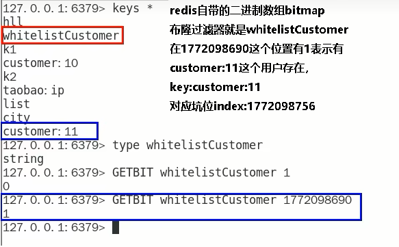

# 手写布隆过滤器

### 布隆过滤器的使用场景

1.  解决缓存穿透的问题，和redis结合bitmap使用

   缓存穿透是什么
   一般情况下，先查询缓存redis是否有该条数据，缓存中没有时，再查询数据库。当数据库也不存在该条数据时，每次查询都要访问数据库，这就是缓存穿透。

   缓存穿透带来的问题是，当有大量请求查询数据库不存在的数据时，就会给数据库带来压力，甚至会拖垮数据库。

   可以使用布隆过滤器解决缓存穿透的问题

   把已存在数据的key存在布隆过滤器中，相当于redis前面挡着一个布隆过滤器。

   当有新的请求时，先到布隆过滤器中查询是否存在:

   如果布隆过滤器中不存在该条数据则直接返回;

   如果布隆过滤器中已存在，才去查询缓存redis，如果redis里没查询到则再查询Mysql数据库

2. 黑名单校验，识别垃圾邮件

   发现存在黑名单中的，就执行特定操作。比如:识别垃圾邮件，只要是邮箱在黑名单中的邮件，就识别为垃圾邮件。

   假设黑名单的数量是数以亿计的，存放起来就是非常耗费存储空间的，布隆过滤器则是一个较好的解决方案。

   把所有黑名单都放在布隆过滤器中，在收到邮件时，判断邮件地址是否在布隆过滤器中即可。

### 手写布隆过滤器

-  结合bitmap类型手写一个简单的布隆过滤器，体会设计思想

- 整体架构

  

- 步骤设计

  redis的setbit/getbit

  

  setBit的构建过程

  - @PostConstruct初始化白名单数据
  - 计算元素的hash值
  - 通过上一步hash值算出对应的二进制数据的坑位
  - 将对应坑位的值修改为数字1，表示存在

  getbit查询是否存在

  - 计算元素的hash值
  - 通过上一步hash值算出对应的二进制数组的坑位
  - 返回对应坑位的值，零表示无，1表示存在

- 

