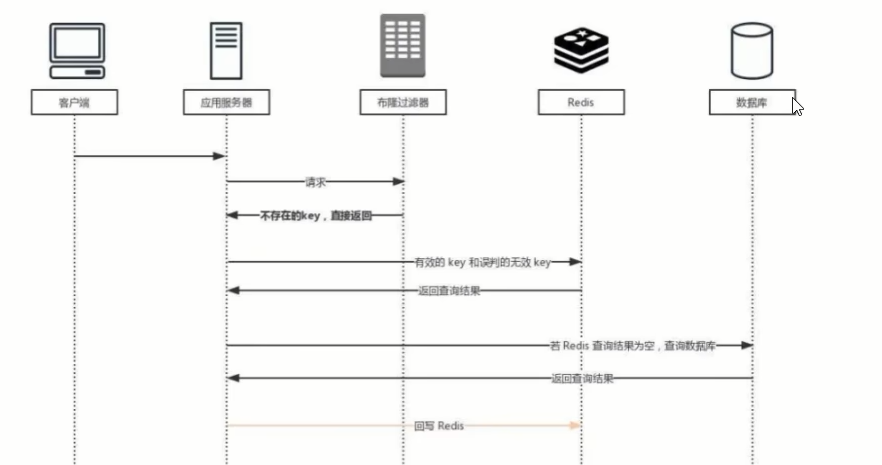

# 缓存穿透

### 是什么

请求去查询一条记录，先查redis无，后查mysql无，都查询不到该条记录但是请求每次都会打到数据库上面去，导致后台数据库压力暴增，这种现象我们称为缓存穿透，这个redis变成了一个摆设。

简单说就是本来无一物，两库都没有，既不在Redis缓存库，也不在mysql，数据库存在被多次暴击风险

### 解决

缓存穿透 -> 恶意攻击 -> 可以空对象缓存或者使用布隆过滤器



#### **方案1：空对象缓存或者缺省值**

一般情况都是OK的

```text
第一种解决方案，回写增强
如果发生了缓存穿透，我们可以针对要查询的数据，在Redis里存一个和业务部门商量后确定的缺省值(比如,零、负数、defaultNull等)
比如，键uid;abcdxxx，值defaultNull作为案例的key和value
先去redis查键uid:abcdxxx没有，再去mysql查没有获得，这就发生了一次穿透现象。
but，可以增强回写机制
mysql也查不到的话也让redis存入刚刚查不到的key并保护mysql。
第一次来查询uid:abcdxxx，redis和mysql都没有，返回nul给调用者，但是增强回写后第二次来查uid:abcdxxx，此时redis就有值了。
可以直接从Redis中读取default缺省值返回给业务应用程序，避免了把大量请求发送给mysql处理，打爆mysql。

但是，此方法架不住黑客的恶意攻击，有缺陷......，只能解决key相同的情况
```

但是会有黑客或者恶意攻击

- 黑客会对你的系统进行攻击，拿一个不存在的id去查询数据，会产生大量的请求到数据库去查询。可能会导致你的数据库由于压力过大而宕掉

- key相同打你系统

  第一次打到mysql，空对象缓存后第二次就返回defaultNull缺省值，避免mysql被攻击，不用再到数据库中去走一圈了

- <font color ='red'>key不同打你系统</font>

  由于存在空对象缓存和缓存回写(看自己业务不限死)，redis中的无关紧要的key也会越写越多<font color ='red'>(记得设置redis过期时间)</font>

#### **方案2：Google布隆过滤器Guava解决缓存穿透**

Guava中布隆过滤器的实现算是比较权威的，所以实际项目中我们可以直接使用Guava布隆过滤器

Guava's  BloomFilter 源码出处：https://github.com/google/guava/blob/master/guava/src/com/google/common/hash/BloomFilter.java

##### 案例：白名单过滤器

- 白名单架构说明

  

- 误判问题，但是概率小可以接受，不能从布隆过滤器删除

- 全部合法的key都需要放入Guava版布隆过滤器+redis里面，不然数据就是返回null

- 代码编写

  建model -> 还是使用redis7-study

  改pom

  ```xml
  <!--guava Google 开源的 Guava 中带的布隆过德器-->
  <dependency>
      <groupId>com.google.guava</groupId>
      <artifactId>guava</artifactId>
      <version>23.0</version>
  </dependency>
  ```

  写YML -> 无变化

  主启动 -> 无变化

  业务类

  ​	新建入门测试案例

  ```java
@Test
  public void testGuava() {
    // 1 创建Guava 版本布隆过滤器
      BloomFilter<Integer> bloomFilter = BloomFilter.create(Funnels.integerFunnel(), 100);
      // 2 判断指定的元素是否存在
      System.out.println(bloomFilter.mightContain(1));// false
      System.out.println(bloomFilter.mightContain(2));// false
      System.out.println();
      // 3 将元素新增进入布隆过滤器
      bloomFilter.put(1);
      bloomFilter.put(2);
      System.out.println(bloomFilter.mightContain(1));// true
      System.out.println(bloomFilter.mightContain(2));// true
  }
  ```
  
  ​	新建Guava案例
  
  
  
  

 	 


