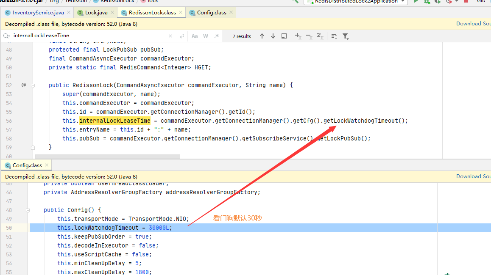

#### 加锁、可重入、续命、解锁

### 分析步骤

- Redis分布式锁过期了，但是业务逻辑还没有处理完怎么办

  需要给对应的key续期

- 守护线程“续命”

  额外起一个线程，定期检查线程是否还持有锁，如果有则延长过期时间；

  Redisson里面就实现了这个方案，使用“看门狗”定期检查（每1/3的锁时间检查1次），如果线程还持有锁，则刷新过期时间。

- 在获取锁成功后，给锁加一个watchdog，watchdog会起一个定时任务，在锁没有被释放且快要过期的时候会续期

  

- 上述源码分析1

  通过Redisson新建出来的锁key，默认是30秒

  

- 上述源码分析2：lock -> tryAcquire -> tryAcquireAsync -> scheduleExpirationRenewal 缓存续期

  

- 上述源码分析3：lock -> tryAcquire -> tryAcquireAsync，锁的可重入性

  通过exists判断，如果锁不存在，则设置值和过期时间，加锁成功

  通过hexists判断，如果锁已存在，并且锁的是当前线程，则证明是重入锁，加锁成功

  如果锁已存在，但锁的不是当前线程，则证明有其他线程持有锁。返回当前锁的过期时间(代表了锁key的剩余生存时间)，加锁失败

  

- 上述源码分析4：

