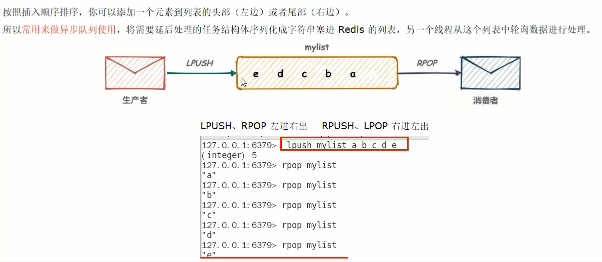
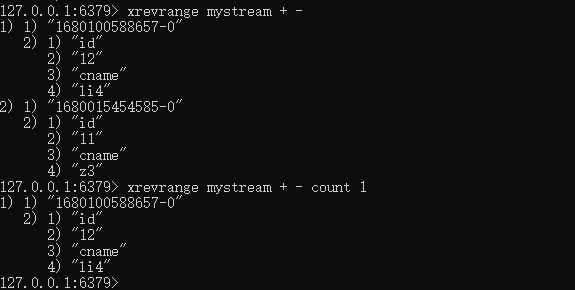
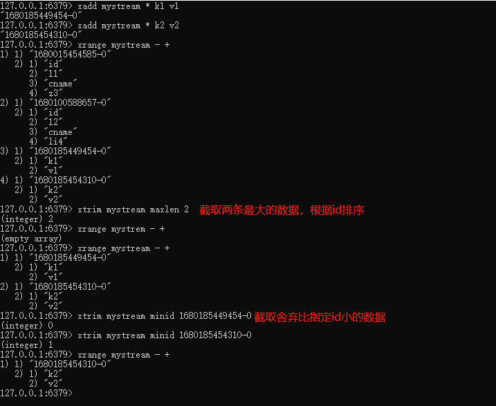

# Redis流(Stream)

### 是什么

Redis5.0 之前的痛点，Redis消息队列的2种方案：

1. List实现消息队列，List实现方式其实就是点对点的模式

   

2. Pub/Sub

Redis5.0版本新增了一个更强大的数据结构---Stream

一句话：Stream流就是Redis版的MQ消息中间件+阻塞队列

### 能干嘛

实现消息队列，它支持消息的持久化、支持自动生成全局唯一ID、支持ack确认消息的模式、支持消费组模式等，让消息队列更加的稳定和可靠

### 底层结构和原理说明

$\textcolor{blue}{一个消息链表，将所有加入的消息都串起来，每个消息都有一个唯一的ID和对应的内容}$

### 基本命令理论简介

## 队列相关指令

##### 消费组相关指令

XINFO GROUPS    打印消费组的详细信息

XINFO STREAM     打印stream的详细信息

##### 四个特殊符号

| - +  | 最小和最大可能出现的Id                             |
| ---- | ---------------------------------------- |
| $    | $表示只消费新的消息，当前流中最大的Id，可用于将要到来的信息          |
| >    | 用于XREADGROUP命令，表示迄今还没有发送给组中使用者的信息，会更新消费者组的最后Id |
| *    | 用于XADD命令，让系统自动生成Id                       |

$\textcolor{red}{基本命令代码实操}$

Redis流实例演示

##### 队列相关命令

### 1.XADD

添加消息到队列末尾，消息ID必须要比上一个ID大，默认用星号表示自动生成ID；* 用于XADD命令中，让系统自动生成ID；

XADD用于向Stream队列中添加消息，如果指定的Stream队列不存在，则该命令执行时会新建一个Stream队列

生成的消息ID，有两部分组成，毫秒时间戳-该毫秒内产生的第一条消息

// * 表示服务器自动生成MessageID(类似MySQL里面主键auto_increment)，后面顺序跟着一堆业务key/value

| 信息条目指的是序列号，在相同的毫秒下序列号从0开始递增，序列号是64位长度，理论上在同一毫秒内生成的数据量无法到达这个级别，因此不用担心序列号会不够用。milisecondsTime指的是Redis节点服务器的本地时间，如果存在当前的毫秒时间截比以前已经存在的数据的时间戳小的话(本地时间钟后跳)，那么系统将会采用以前相同的毫秒创建新的ID，也即redis 在增加信息条目时会检查当前 id 与上一条目的 id，自动纠正错误的情况，一定要保证后面的 id 比前面大，.个流中信息条目的ID必须是单调增的，这是流的基础。 |
| ---------------------------------------- |
| 客户端显示传入规则: Redis对于ID有强制要求，格式必须是**时间戳-自增Id**这样的方式，且后续ID不能小于前一个ID |
| Stream的消息内容，也就是图中的Messaget它的结构类似Hash结构，以kev-value的形式存在 |

### 2.XRANGE key start end [COUNT count]

 用于获取消息列表（可以指定范围），忽略删除的消息

start 表示开始值，-代表最小值

end 表示结束值，+代表最大值

count 表示最多获取多少个值

### 3.XREVRANGE key end start [COUNT count]

根据ID降序输出

### 4.XDEL key id [id ...]

### 5.XLEN key

### 6.XTRIM key MAXLEN|MINID

用于对Stream的长度进行截取，如超长会进行截取

MAXLEN 允许的最大长度，对流进行修剪限制长度

MINID 允许的最小id，从某个id值开始比该id值小的将会被抛弃

### 7.XREAD \[COUNT count] [BLOCK milliseconds] STREAMS key [key ...] id [id ...]

可以读取多个key

**用于获取消息(阻塞/非阻塞)**

​	只会返回大于指定ID的消息，COUNT最多读取多少条消息；BLOCK是否以阻塞的方式读取消息，默认不阻塞，如果milliseconds设置为0，表示永远阻塞

**非阻塞**

- $表特殊ID，表示以当前Stream已经存储的最大的ID作为最后一个ID，当前Stream中不存在大于当前最大ID的消息，因此此时返回nil
- 0-0代表从最小的ID开始获取Stream中的消息，当不指定count，将会返回Stream中的所有消息，注意也可以使用0 (00/000也都是可以的)

  ​

**阻塞**

$\textcolor{red}{小总结（类似Java里面的阻塞队列）}$

Stream的基础方法，使用XADD存入消息和XREAD循环阻塞读取消息的方式可以实现简易版的消息队列

---

