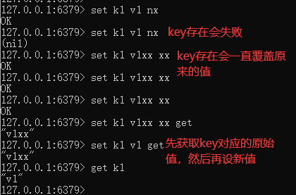

# Redis字符串(String)

官网：https://redis.io/docs/data-types/strings/


单值单value

案例：

###1.$\textcolor{red}{最 常 用：set\quad key\quad value  }$ |  get key


**返回值：**

设置成功则返回OK，返回nil为未执行Set命令，如不满足NX，XX条件等。

若使用GET参数，则返回该键原来的值，或在键不存在时nil。



如何获得设置指定的key过期的Unix时间，单位为秒

```java
System.out.println(Long.toString(System.currentTimeMillis()/1000L));
```


###2.同时设置/获取多个键值

MSET key value [key value...]

MGET key [key ...]

mset/mget/msetnx


###3.获取指定区间范围内的值

getrange/setrange


### 4.数值增减

$\textcolor{red}{一定要是数据才能进行加减}$

递增数字：INCR key

增加指定的整数：INCRBY key increment

递减数值：DECR key

减少指定的整数：DECRBY key decrement


### 5.获取字符串长度和内容追加

获取字符串长度：strlen key

字符串内容追加：append key value


###6.分布式锁

setnx key value

setex(set with expire)键秒值/setnx(set if not exist)


