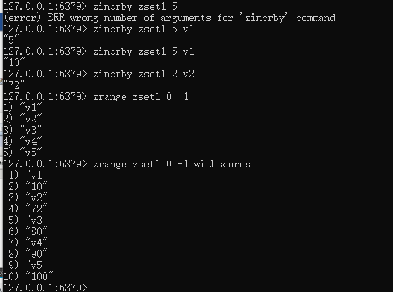
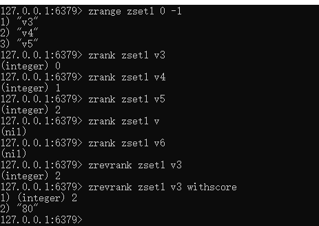

# Redis有序集合Zset(sorted set)

在set基础上，每个val值前加一个score分数值。之前set是k1 v1 v2 v3，现在zset是 k1 score1 v1 score2 v2

案例：

向有序集合中加入一个元素和该元素的分数

### 1.ZADD key score member [score member ...] 

添加元素

### 2.ZRANGE key start stop [WITHSCORES]

按照元素分数从小到大的顺序返回索引从start到stop之间的所有元素

### 3.zrevrange key start stop [WITHSCORES]

反转集合，按照元素分数从大到小的顺序返回索引从start到stop之间的所有元素

### 4.ZRANGEBYSCORE key min max 【WITHSCORES】【LIMIT offset count】

获取指定分数范围的元素，可以在min和max前面加个(，表示不包含

limit作用是返回限制，limit开始下标步，一共多少步

### 5.ZSCORE key member

获取元素的分数

### 6.ZCARD key

获取集合中元素的数量

### 7. zrem key member [member ...]

某个score对应的value值，作用是删除元素

### 8.ZINCRBY key increment member

增加某个元素的分数

### 9.ZCOUNT key min max

获得指定分数内的元素个数

### 10.ZMPOP numkeys key [key ...] MIN|MAX [COUNT count]

从键名列表中的第一个非空排序集中弹出一个或多个元素，他们是成员分数对

### 11.zrank key member [withscore]

作用是通过子value获得下标值

### 12.zrevrank key member [withscore]

作用是通过子value逆序获得下标值

