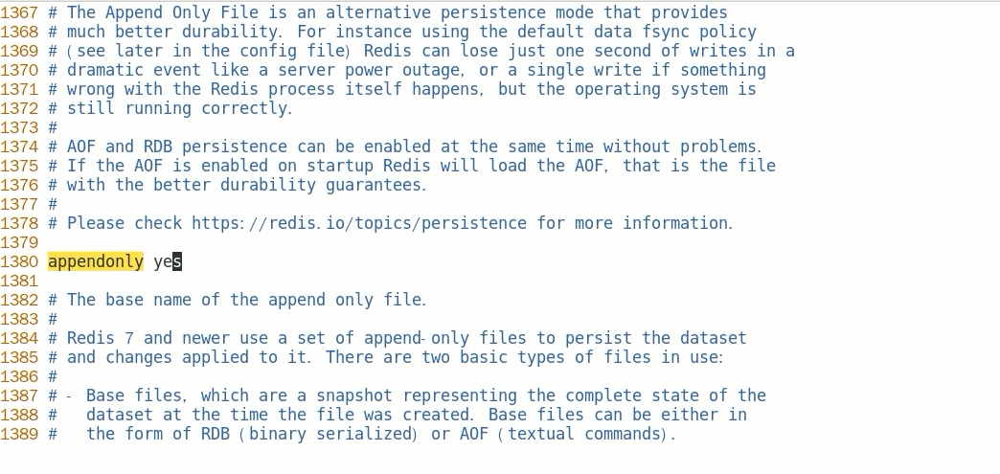

# AOF案例演示和说明

### 配置文件说明 (6 VS 7)

#### 如何开启aof

#### 使用默认写回策略

#### aof文件-保存路径

- redis6及以前

  AOF保存文件的位置和RDB保存文件的位置一样，都是通过redis.conf配置文件的dir配置

.jpg)

- redis7最新

.jpg)

**一句话：**

#### aof文件-保存名称

- redis6及以前 ，有且仅有一个

.jpg)

- Redis7 Multi Part AOF的设计

从1个文件到3个文件

.jpg)

**MP-AOF实现**
**方案概述**
顾名思义，MP-AOF就是将原来的单个AOF文件拆分成多个AOF文件。在MP-AOF中，我们将AOF分为三种类型,
分别为:

- **BASE: 表示基础AOF**，它一般由子进程通过重写产生，该文件最多只有一个。

- **INCR:表示增量AOF**，它一般会在AOFRW开始执行时被创建，该文件可能存在多个。

- **HISTORY**:表示历史AOF，它由BASE和INCR AOF变化而来，每次AOFRW成功完成时，本次AOFRW之前对应的BASE和INCR AOF都将变为HISTORY，HISTORY类型的AOF会被Redis自动删除。

为了管理这些AOF文件，我们引入了一个manifest (清单)文件来跟踪、管理这些AOF。同时，为了便于AOF备份和拷贝，我们将所有的AOF文件和manifest文件放入一个单独的文件目录中，目录名由appenddirname配置(Redis 7.0新增配置项)决定。

Redis7.0config 中对应的配置项

