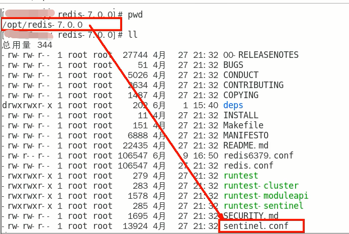

# 案例演示

### Redis Sentinel架构，前提说明

- 3个哨兵：自动监控和维护集群，不存放数据，只是吹哨人
- 1主2从：用于数据读取和存放

### 操作步骤

1. $\textcolor{red}{/myredis目录下新建或者拷贝sentinel.conf文件按，名字绝对不能错}$

2. 先看看/opt目录下默认的sentinel.conf文件的内容

   

3. 重要参数项说明

   - bind：服务监听地址，用于客户端连接，默认本机地址

   - daemonize：是否以后台daemon方式运行

   - protected-model：安全保护模式

   - port：端口

   - logfile：日志文件路径

   - pidfile：pid文件路径

   - dir：工作目录

   - $\textcolor{red}{sentinel monitor <master-name> <ip> <redis-port> <quorum>}$

     设置要监控的master服务器

     quorum表示最少有几个哨兵认可客观下限，同意故障迁移的法定票数

   - $\textcolor{red}{sentinel auth-pass <master-name> <password>}$
   - 其他

4. ​

