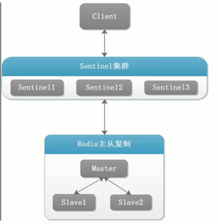

# 哨兵运行流程和选举原理

当一个主从配置中master失效后，sentinel可以选举出一个新的master用于自动接替原master的工作，主从配置中的其他redis服务器自动指向新的master同步数据，一般建议sentinel采取奇数台，防止某一台sentinel无法连接到master导致误切换

### 运行流程，故障切换

- 三个哨兵监控一主二从，正常运行中

  

- SDown主观下线(Subjectively Down)

  1. SDOWN（主观不可用）是**单个sentinel自己主观上**检测到的关于master的状态，从sentinel的角度来看，如果发送了PING心跳后，在一定时间内没有收到合法的回复，就达到了SDOWN的条件。

  2. sentinel配置文件中的down-after-milliseconds设置了判断主观下线的时间长度

  3. 说明

     

- ODown客观下线(Objectively Down)

- 选举出领导者哨兵(哨兵中选出兵王)

- 由兵王开始推动故障切换流程并选出新的master

